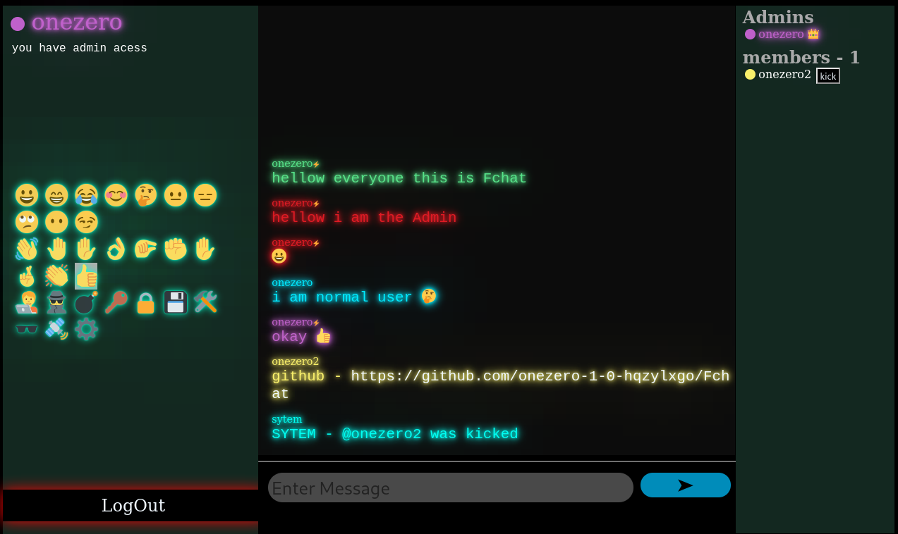

# Fchat

This is a web application designed for the dark web, without using JavaScript.

This web application allows users to chat anonymously on the dark web. It works under the safest browser settings, such as Tor Browser. The application does not use any server-side code like JavaScript. It is built using PHP, HTML, and CSS. The application does not use a database management system; chat history and user data are stored in plain text files called `users.txt` and `chats.txt`.

## How to Install

Follow these steps to set up the chat application:

1. **Clone the repository**:
   `git clone https://github.com/onezero-1-0-hqzylxgo/Fchat.git`

2. **Install Tor**:  
   First, update your package list and install Tor:
   `sudo apt-get update && sudo apt-get install tor`

3. **Navigate to the Fchat directory**:
   `cd Fchat`

4. **Copy files to the web server directory**:  
   Copy the files to your web server's document root:
   `cp ./* /var/www/html/`
   Alternatively, you can change the Apache configuration to point to the location where your files are stored.

5. **Start the Apache web server**:  
   Run the following command to start Apache:
   `sudo service apache2 start`

6. **Configure Tor for hidden services**:  
   Open the Tor configuration file:
   `sudo nano /etc/tor/torrc`
   Uncomment the lines related to hidden services and configure them.

7. **Start the Tor service**:  
   Run the following command to start Tor:
   `sudo systemctl start tor`

8. **Get your onion address**:  
   Once Tor is running, use the following command to find your Tor hidden service's `.onion` address:
   `cat /var/lib/tor/hidden_service/hostname`
   This will display your website's onion address, which can be accessed through Tor (dark web address).

## Notes

- This chat application is designed for use on the dark web via Tor and should not be accessed through regular browsers.
- All data (user information and chat history) is stored in plain text files, which is suitable for minimalistic setups but not recommended for production use or large-scale applications.
- Ensure that you configure Apache and Tor properly for security and anonymity.
